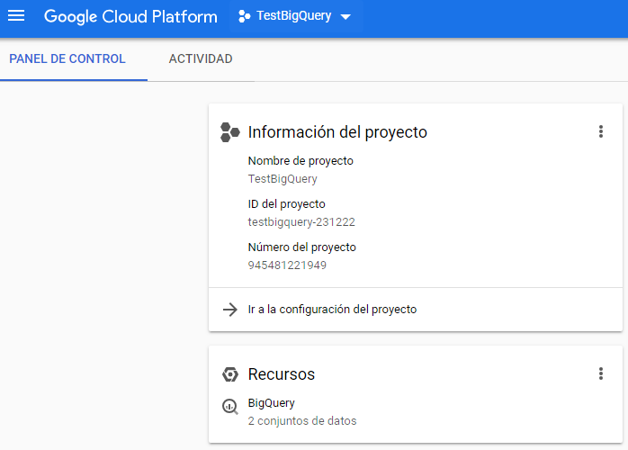
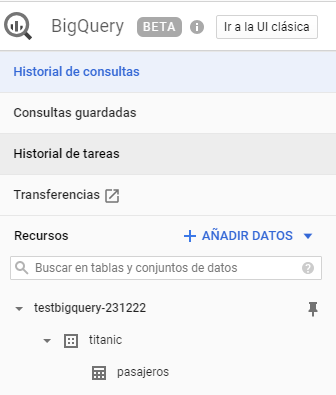
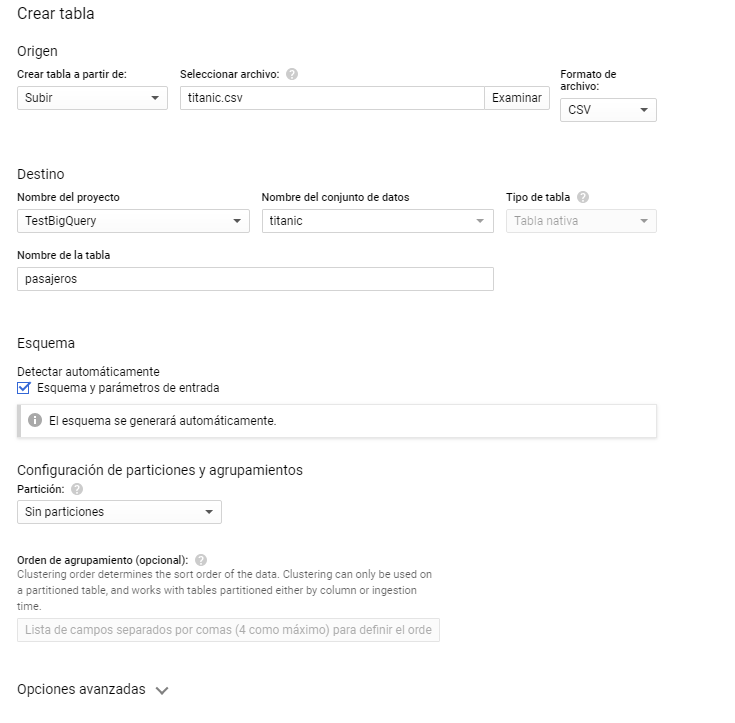
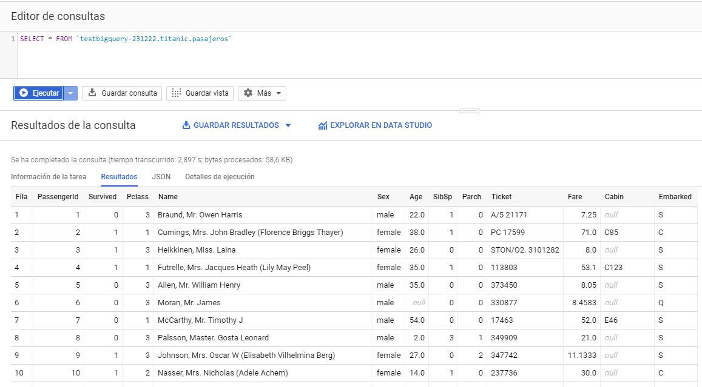

# Acerca de

Repositorio que contiene un DataSet el cual fue procesado por BigQuery y Data Studio

# Archivos

* `titanic.csv`: contiene los datos del dataset
* `bigquert - titanic`: `https://datastudio.google.com/open/1fb3ag5wMG-aVaHoAI6rk1b_-R-PPsG7q` Reporte en Data Studio

# Desarrollo

* `Ingesta de datos`: Para la ingesta de datos se creo un proyecto en GCP llamado 'TestBigQuery' 
         

Dentro de las herramientas de GCP, se abrio BigQuery y se creo un conjunto de datos llamado 'titanic' con una tabla llamada 'pasajeros'

La creación de la tabla 'pasajeros' se realizó con la misma estructuración del archivo csv

* `Exploración de datos`: Se realizaron algunas consultas en BigQuery para analisis de datos. 

* `Despliegue`: El despliegue se realizó explorando los datos en la herramienta Data Studio, en donde se generó graficos enfocados en los pasajeros sobrevivientes.
* https://datastudio.google.com/open/1fb3ag5wMG-aVaHoAI6rk1b_-R-PPsG7q
